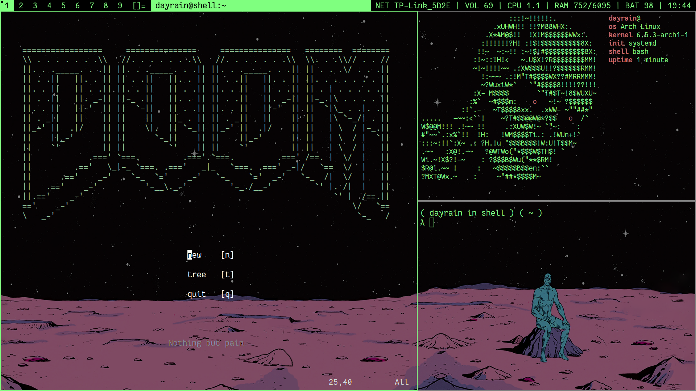

## Neovim

Install [packer](https://github.com/wbthomason/packer.nvim) first

```shell
git clone --depth 1 https://github.com/wbthomason/packer.nvim\
 ~/.local/share/nvim/site/pack/packer/start/packer.nvim
```

Then enter nvim and type

```
:PackerInstall
:PackerCompile
```



