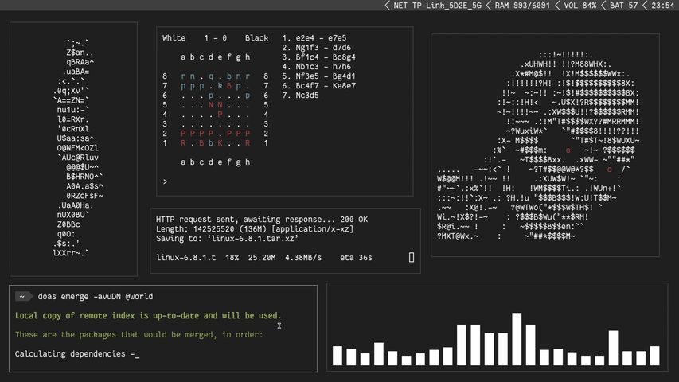

# dotfiles

- OS: [Gentoo](https://gentoo.org)
- Compositor: [dwl](https://codeberg.org/dwl/dwl)
- Status bar: [ergo](https://github.com/d4yr41n/ergo)
- Font: [Fantasque Sans Mono](https://github.com/belluzj/fantasque-sans)
- Menu: [wmenu](https://sr.ht/~adnano/wmenu)
- Terminal: [alacritty](https://github.com/alacritty/alacritty)
- Text editor: [vim](https://github.com/vim/vim)
- Shell: [bash](https://git.savannah.gnu.org/cgit/bash.git)

