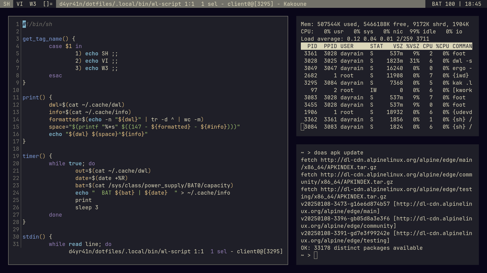

# Dotfiles

- OS: [Alpine](https://www.alpinelinux.org)
- Compositor: [Dwl](https://codeberg.org/dwl/dwl)
- Status bar: [Ergo](https://github.com/d4yr41n/ergo)
- Fonts: [Fira Mono](https://fonts.google.com/specimen/Fira+Mono)
- Menu: [Ring](https://github.com/d4yr41n/wayne/tree/main/ring)
- Terminal: [Alacritty](https://github.com/alacritty/alacritty)
- Text editor: [Helix](https://github.com/helix-editor/helix)
- Theme: [Log2](https://github.com/d4yr41n/log2)
- Browser: [Chromium](https://github.com/chromium/chromium)
- Shell: [Ash](https://busybox.net)

